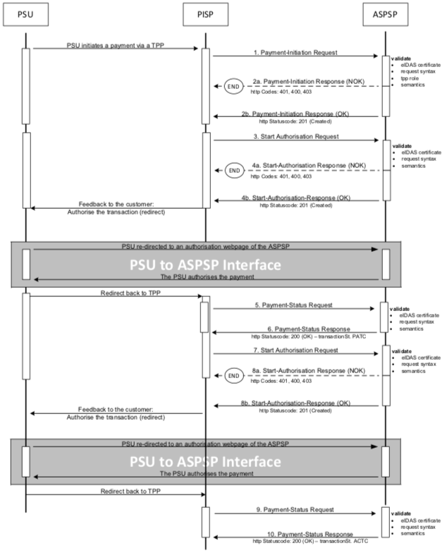

# Strong Customer Authentication (SCA) approaches
The API design differs across the various SCA approaches:

* Redirect - the authorisation is redirected via the TPP
* OAuth2 - the authorisation is made with a token
* Decoupled - the authorisation is made directly between the ASPSP and the PSU
* Embedded

Note! The Embedded SCA Approach is N/A.

The payment initiation flow depends on the SCA approach implemented by the ASPSP. 
The following example flows vary depending on the APSP implementation.

##  Redirect SCA approach
### Explicit start of the authorisation process
If the ASPSP supports the Redirect SCA approach, the message flow within the Payment Initiation Service (PIS) is simple. 
The Payment Initiation Request from the TPP to the ASPSP, is followed by an explicit request from the TPP to start the authorisation. The PSU is redirected to the ASPSP authorisation site to authorise the transaction. 
A status request is then sent by the TPP to validate the transaction.

1. The PSU initiates a payment.
1. The TPP sends a Payment Initiation Request to the ASPSP.
1. The ASPSP sends a Payment Initiation Response to the TPP.
1. The TPP sends an Auhorisation Request to the ASPSP.
1. The ASPSP starts the Authorisation Response to the TPP.
1. The PSU gets feedback from the TPP, as an example: "Authorise the transaction".
1. The PSU is redirected to an ASPSP authorisation webpage to authorise the transation.
1. The PSU is then redirected to the TPP.
1. A Payment Status Request is sent by the TPP to the ASPSP.
1. A Payment Status Respond is sent by the ASPSP to the TPP.

### Explicit start of the authorisation process with confirmation code
In addition to the Explicit start of the authorisation process, an authorisation confirmation request is sent from the TPP to the ASPSP to validate the transaction with a ''confirmation code''.

1. The PSU initiates a payment.
1. TPP sends a Payment Initiation Request (PIR) to the ASPSP.
1. The ASPSP sends a Payment Initiation Response to the TPP.
1. The TPP sends an Auhorisation Request to the ASPSP.
1. The ASPSP starts the Authorisation Response to the TPP.
1. The PSU gets feedback from the TPP, as an example: "Authorise the transaction".
1. The PSU is redirected to an ASPSP authorisation webpage to authorise the transation.
1. The PSU is then redirected to the TPP.
1. A Transaction Authorisation Confirmation Request is sent by the TPP to the ASPSP.
1. A  Transaction Authorisation Confirmation Respond is sent by the ASPSP to the TPP.
1. A Payment Status Request is sent by the TPP to the ASPSP.
1. A Payment Status Respond is sent by the ASPSP to the TPP.

### Implicit start of the authorisation process
If no additional data is needed from the TPP, the ASPSP can start the authorisation process implicitly.

In this case, the redirection of the PSU browser session happens directly after the Payment Initiation Response. In addition a SCA status request can be sent by the TPP to validate the transaction.

1. The PSU initiates a payment.
1. TPP sends a Payment Initiation Request to the ASPSP.
1. The ASPSP sends a Payment Initiation Response to the TPP and a ''Redirect'', with information to the PSU to authorise the transation: "Authorise the transaction".
1. The PSU is redirected to an ASPSP authorisation webpage to authorise the transation.
1. The PSU is then redirected back to the TPP.
1. A Payment Status Request is sent by the TPP to the ASPSP.
1. A Payment Status Respond is sent by the ASPSP to the TPP.

### Implicit start of the authorisation processs with confirmation code
In addition to the Implicit start of the authorisation process, an authorisation confirmation request is sent from the TPP to the ASPSP to validate the transaction with a ''confirmation code''.

1. The PSU initiates a payment.
1. TPP sends a Payment Initiation Request to the ASPSP.
1. The ASPSP sends a Payment Initiation Response to the TPP and a ''Redirect'', with information to the PSU to authorise the transation: "Authorise the transaction".
1. The PSU is redirected to an ASPSP authorisation webpage to authorise the transation.
1. The PSU is then redirected back to the TPP.
1. A Transaction Authorisation Confirmation Request is sent by the TPP to the ASPSP.
1. A Transaction Authorisation Confirmation Respond is sent by the ASPSP to the TPP.
1. A Payment Status Request is sent by the TPP to the ASPSP.
1. A Payment Status Respond is sent by the ASPSP to the TPP.

## OAuth2 SCA approach
### Implicit start of the authorisation process
If the ASPSP supports the OAuth2 SCA Approach, the flow is very similar to the Redirect SCA Approach with implicit start of the Authorisation Process. Instead of redirecting the PSU directly to an authentication server, the OAuth2 protocol is used for the transaction authorisation process.

 
1. The PSU initiates a payment.
1. TPP sends a Payment Initiation Request (PIR) to the ASPSP.
1. OAuth is started.
1. The PSU gets feedback from the TPP, as an example: "Authorise the transaction".
1. The PSU is redirected to an ASPSP authorisation webpage.
1. The PSU is authorised.
1. The PSU authorises the payment.
1. The PSU is then redirected to the TPP.
1. A Token Request is sent by the TPP to the ASPSP.
1. A Token Respond is sent by the ASPSP to the TPP.
1. A Payment Status Request is sent by the TPP to the ASPSP.
1. A Payment Status Respond is sent by the ASPSP to the TPP.

### Implicit start of the authorisation process with confirmation code
In addition to the Implicit start of the authorisation process, an authorisation confirmation request is sent from the TPP to the ASPSP to validate the transaction with a ''confirmation code''.

Note! The OAuth2 SCA Approach with explicit start of the Authorisation Process and with transaction confirmation step is treated analogously.

1. The PSU initiates a payment.
1. TPP sends a Payment Initiation Request (PIR) to the ASPSP.
1. OAuth is started.
1. The PSU gets feedback from the TPP, as an example: "Authorise the transaction".
1. The PSU is redirected to an ASPSP authorisation webpage.
1. The PSU is authorised.
1. The PSU authorises the payment.
1. The PSU is then redirected to the TPP.
1. A Token Request is sent by the TPP to the ASPSP.
1. A Token Respond is sent by the ASPSP to the TPP.
1. A Transaction Authorisation Confirmation Request is sent by the TPP to the ASPSP.
1. A Transaction Authorisation Confirmation Respond is sent by the ASPSP to the TPP.
1. A Payment Status Request is sent by the TPP to the ASPSP.
1. A Payment Status Respond is sent by the ASPSP to the TPP.

## Decoupled SCA Approach
### Implicit start of the authorisation process
The transaction flow in the Decoupled SCA approach is similar to the Redirect SCA approach. The difference is that the ASPSP is asking the PSU to authorise the payment, e.g. via a dedicated mobile app, or any other application or device independent from the online banking frontend. The ASPSP asks the TPP to inform the PSU about this authentication by sending a corresponding PSU Message like "Please use your xxx app to authorise the payment".
After the SCA having been processed between ASPSP and PSU, the TPP must ask for the result of the transaction.

The ASPSP pushes the challenge to an authorisation app and requests a SCA PSU to ASPSP Interface.

1. The PSU initiates a payment.
1. The TPP sends a Payment Initiation Request to the ASPSP.
1. The ASPSP sends a Payment Initiation Response to the TPP with apporach ''DECOUPLED''.
1. The PSU gets feedback from the TPP, as an example: "Authorise the transaction via app „xxx".
1. The ASPSP pushes the challenge to an authorisation app and requests a SCA method.
1. The PSU authorises the transaction.
1. A Payment Status Request is sent by the TPP to the ASPSP.
1. A Payment Status Respond is sent by the ASPSP to the TPP.

## Embedded SCA approach 
Note! This SCA is N/A.

### Embedded SCA without SCA method
The ASPSP processes the SCA methods in the PISP – ASPSP interface. 

The PSU always needs to authenticate himself with a first factor, before any account or SCA method details will be available to the PISP. So even in cases where the Payment Initiation is accepted without an SCA method, the PSU is asked (via PISP) to provide the PSU Identification, e.g. a password or an OTP. 

The exemple flows show scenarios where complexities like SCA processing and choosing an SCA method will be added.

Note! In case where OAuth2 is requested by the ASPSP as a pre-step for PSU authentication, the sequence of the PSU authentication with the first authentication factor is omitted. This applies also for all examples for the Embedded SCA Approach.

### Embedded SCA with only one SCA method available
In case where only one SCA method is available, the "Authorise Transaction Request" is added to the flow, where the TPP is transmitting the authentication data of the customer, e.g. an OTP with included dynamic linking to the transaction details.

### Embedded SCA with Selection of an SCA method
In the following flow, there is a selection of SCA methods added in case the ASPSP supports several SCA methods for the corresponding PSU. First, the ASPSP transmits the available methods for the PISP to filter, since all authentication methods might not be supported. The available methods are then presented to the PSU.

## Combination of flows due to mixed SCA approaches
If an ASPSP supports one decoupled SCA method and one other SCA method, the flows can be mixed. Then the ASPSP needs to start the process with the assumption of one specific SCA approach to offer all available SCA methods to the PSU.

If the ASPSP starts the payment initiation flow with a Redirect SCA approach, the PSU can select the decoupled authentication method on the ASPSP authentication site. This is then transparent for the TPP and has no influence on the transaction flows.

If the ASPSP starts the payment initiation flow with the Embedded SCA approach, the ASPSP will provide a list of available SCA methods to the PSU via the TPP. If the PSU selects an authentication method which requires the Decoupled SCA approach, the ASPSP is branching into the Decoupled SCA transaction flow accordingly: 
The ASPSP will return:
* the corresponding HTTP header ASPSP-SCA-Approach with value ''DECOUPLED'' and 
* the current status of the payment initiation, e.g. ''ACTC'' for correct technical checks, but will return no hyperlink for further action other than the ''self'' and ''status'' hyperlink. 
The next TPP request is ''GET Status Request'' to get the final status of the transaction after having processed the SCA method.

If the ASPSP needs to decide between the Decoupled SCA apporach and the Redirect SCA approach, the ASPSP can first make the SCA methods available for the PSU to select the SCA method and then branch.

## Multilevel SCA approach
The multilevel SCA approach supports the authorisation of a payment by several users. 

### Example of Multilevel Redirect SCA approach
Multilevel SCAs are always handled with explicit start of the authorisations. In the following example, the Redirect SCA is used.

1. The PSU initiates a payment.
1. TPP sends a Payment Initiation Request to the ASPSP.
1. The ASPSP validates the Payment Initiation Request.
1. The TPP initiates an explicit request to start the authorisation. 
1. The ASPSP validates the start of the authorisation.
1. The PSU gets feedback from the TPP, as an example: "Authorise the transaction".
1. The PSU is redirected to the ASPSP SCA authentication site to authorise the payment.
1. The PSU is then redirected to the TPP.
1. A Payment Status Request is sent by the TPP to the ASPSP.
1. A Payment Status Respond is sent by the ASPSP to the TPP.
1. A Start Authorisation Request is sent by the TPP to the ASPSP.
1. A Start Authorisation Respond is sent by the ASPSP to the TPP.
1. The PSU gets feedback from the TPP, as an example: "Authorise the transaction".
1. The PSU is redirected to the ASPSP SCA authentication site to authorise the payment.
1. The PSU is then redirected to the TPP.
1. A Payment Status Request is sent by the TPP to the ASPSP.
1. A Payment Status Respond is sent by the ASPSP to the TPP.

Note! This flow is not depending on the SCA approach. Multilevel SCA transactions are performed by using **n** times the Start Authorisation Request for **n** times SCA, where the corresponding SCA flow is replacing the Redirect SCA flow above. These SCA processes could also be performed simultaneously.