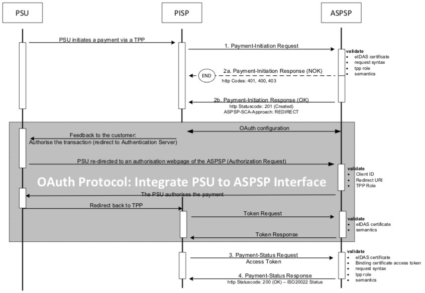

#  Strong Customer Authentication (SCA) Approaches
The API design differs across the various SCA approaches:

* Redirect
* OAuth2
* Decoupled
* Embedded

Note! The Embedded SCA Approach is N/A.

The payment initiation flow depends on the SCA approach implemented by the ASPSP. 
The following example flows can vary depending on the APSP implementation.

# Payment initiation flows

##  Redirect SCA Approach
### Explicit start of the authorisation process
1. The PSU initiates a payment.
    1. The TPP sends a Payment Initiation Request to the ASPSP.
    1. The ASPSP sends a Payment Initiation Response to the TPP.
    1. The TPP sends an Auhorisation Request to the ASPSP.
    1. The ASPSP starts the Authorisation Response to the TPP.
1. The PSU gets feedback from the TPP, as an example: "Authorise the transaction".
1. The PSU is redirected to an ASPSP authorisation webpage to authorise the transation.
1. The PSU is then redirected to the TPP.
    1. A Payment Status Request is sent by the TPP to the ASPSP.
    1. A Payment Status Respond is sent by the ASPSP to the TPP.

    

### Explicit start of the authorisation process with confirmation code
In addition to the Explicit start of the authorisation process, an authorisation confirmation request is sent from the TPP to the ASPSP.

1. The PSU initiates a payment.
    1. TPP sends a Payment Initiation Request (PIR) to the ASPSP.
    1. The ASPSP sends a Payment Initiation Response to the TPP.
    1. The TPP sends an Auhorisation Request to the ASPSP.
    1. The ASPSP starts the Authorisation Response to the TPP.
1. The PSU gets feedback from the TPP, as an example: "Authorise the transaction".
1. The PSU is redirected to an ASPSP authorisation webpage to authorise the transation.
1. The PSU is then redirected to the TPP.
    1. A Transaction Authorisation Confirmation Request is sent by the TPP to the ASPSP.
    1. A  Transaction Authorisation Confirmation Respond is sent by the ASPSP to the TPP.
    1. A Payment Status Request is sent by the TPP to the ASPSP.
    1. A Payment Status Respond is sent by the ASPSP to the TPP.

    

### Implicit start of the authorisation process
ASPSPs might start the authorisation process implicitly in case of no additional data is needed from the TPP. This optimisation process results in the following flow (which is exactly the Redirect SCA Approach flow from the version 1.0 and 1.1 of the Implementation Guideline before authorisation sub-resources have been established). In this case, the redirection of the PSU browser session happens directly after the Payment Initiation Response. In addition an SCA status request can be sent by the TPP to follow the SCA process.

1. The PSU initiates a payment.
    1. TPP sends a Payment Initiation Request (PIR) to the ASPSP.
    1. The ASPSP sends a Payment Initiation Response to the TPP.
    1. The TPP sends an Auhorisation Request to the ASPSP.
    1. The ASPSP starts the Authorisation Response to the TPP.
1. The PSU gets feedback from the TPP, as an example: "Authorise the transaction".
1. The PSU is redirected to an ASPSP authorisation webpage to authorise the transation.
1. The PSU is then redirected to the TPP.
    1. A Payment Status Request is sent by the TPP to the ASPSP.
    1. A Payment Status Respond is sent by the ASPSP to the TPP.

    

### Implicit start of the authorisation processs with confirmation code
In addition to the scenario above, an authorisation confirmation request might be requested by the ASPSP from the TPP after the session is re-redirected to the TPP’s system and after the TPP's control on session fixation. In the end, a payment status request might be needed by the TPP to control the exact status of the payment initiation:
1. The PSU initiates a payment.
    1. TPP sends a Payment Initiation Request (PIR) to the ASPSP.
    1. The ASPSP sends a Payment Initiation Response to the TPP.
    1. The TPP sends an Auhorisation Request to the ASPSP.
    1. The ASPSP starts the Authorisation Response to the TPP.
1. The PSU gets feedback from the TPP, as an example: "Authorise the transaction".
1. The PSU is redirected to an ASPSP authorisation webpage to authorise the transation.
1. The PSU is then redirected to the TPP.
    1. A Transaction Authorisation Confirmation Request is sent by the TPP to the ASPSP.
    1. A  Transaction Authorisation Confirmation Respond is sent by the ASPSP to the TPP.
    1. A Payment Status Request is sent by the TPP to the ASPSP.
    1. A Payment Status Respond is sent by the ASPSP to the TPP.

    

## OAuth2 SCA Approach
### Implicit Start of the Authorisation Process
If the ASPSP supports the OAuth2 SCA Approach, the flow is very similar to the Redirect SCA Approach with implicit start of the Authorisation Process. Instead of redirecting the PSU directly
 
 1. The PSU initiates a payment.
    1. TPP sends a Payment Initiation Request (PIR) to the ASPSP.
    1. OAuth is started.
1. The PSU gets feedback from the TPP, as an example: "Authorise the transaction".
1. The PSU is redirected to an ASPSP authorisation webpage.
1. The PSU is authorised.
1. The PSU authorises the payment.
1. The PSU is then redirected to the TPP.
    1. A Token Request is sent by the TPP to the ASPSP.
    1. A Token Respond is sent by the ASPSP to the TPP.
    1. A Transaction Authorisation Confirmation is sent by the TPP to the ASPSP.
    1. A Transaction Confirmation Respond is sent by the ASPSP to the TPP.
    1. A Payment Status Request is sent by the TPP to the ASPSP.
    1. A Payment Status Respond is sent by the ASPSP to the TPP.

    

### Implicit start of the authorisation process
In addition to the scenario above, an authorisation confirmation request might be requested by the ASPSP from the TPP after the session is re-redirected to the TPP’s system and after the TPP's control on session fixation. In the end, a payment status request might be needed by the TPP to control the exact status of the payment initiation.

Note! The OAuth2 SCA Approach with explicit start of the Authorisation Process and with transaction confirmation step is treated analogously.

## Decoupled SCA Approach
### Implicit start of the authorisation process
The transaction flow in the Decoupled SCA Approach is similar to the Redirect SCA Approach. The difference is that the ASPSP is asking the PSU to authorise the payment e.g. via a dedicated mobile app, or any other application or device which is independent from the online banking frontend. The ASPSP is asking the TPP to inform the PSU about this authentication by sending a corresponding PSU Message like "Please use your xxx App to authorise the payment".
After the SCA having been processed between ASPSP and PSU, the TPP then needs to ask for the result of the transaction. In the following, a flow with an implicit start of the authorisation process is shown:

The ASPSP pushes the challenge to an authorisation app and requests a strong customer authentication (SCA) PSU to ASPSP Interface.

## Embedded SCA Approach 
### Embedded SCA without SCA method (e.g. Creditor in exemption list)
 In the following, several exemplary flows are shown, where the ASPSP has chosen to process the SCA methods through the PISP – ASPSP interface. In any case, the PSU normally will need to authenticate himself with a first factor, before any account or SCA method details will be available to the PISP. So even in case where the Payment Initiation is accepted without an SCA method due e.g. to an exemption list, the PSU is asked via the PISP to provide the PSU Identification and e.g. a password or an OTP. The later exemplary flows then will show scenarios, where complexities like SCA processing and choosing an SCA method will be added.
 Note! In case where OAuth2 is requested by the ASPSP as a pre-step for PSU authentication, the sequence of the PSU authentication with the first authentication factor is omitted. This applies also for all examples for the Embedded SCA Approach.

### Embedded SCA with only one SCA method available
  In case where only one SCA method is available, the "Authorise Transaction Request" is added to the flow, where the TPP is transmitting the authentication data of the customer, e.g. an OTP with included dynamic linking to the transaction details.

### Embedded SCA with Selection of an SCA method
 In the following flow, there is a selection of an SCA method added in case of the ASPSP supporting several SCA methods for the corresponding PSU. The ASPSP transmits first the available methods to the PISP. The PISP might filter them, if not all authentication methods can be technically supported. The available methods then are presented to the PSU for choice.

## Combination of flows due to mixed SCA Approaches
If an ASPSP supports for a PSU at least one decoupled SCA method and at the same time at least one SCA method that is not decoupled, then the above flows might be mixed as follows, since the ASPSP then needs to start the process with the assumption of one specific SCA approach to offer all available SCA methods to the PSU.

In case the ASPSP is starting the payment initiation flow with a redirect the PSU can choose on the authentication site of the ASPSP the decoupled authentication method. This is then transparent for the TPP and has no influence on the flows defined above.

In case the ASPSP is starting the payment initiation flow with the Embedded SCA Approach the ASPSP will provide a list of available SCA methods to the PSU via the TPP. If the PSU chooses an authentication method which requires the Decoupled SCA Approach, then the ASPSP is branching into the transaction flow for the Decoupled Approach as shown above: The ASPSP will return the corresponding HTTP header ASPSP-SCA-Approach with value "DECOUPLED" and the current status of the payment initiation, e.g. "ACTC" for correct technical checks but will return no hyperlink for further action other than the "self" and "status" hyperlink. The next request of the TPP then needs to be the GET Status Request to get the final status of the transaction after having processed the SCA method.

In case the ASPSP needs to decide between the Decoupled and the Redirect SCA approach, the ASPSP also might first offer the SCA methods available to the PSU and then branch after the selection of the PSU into the Decoupled or Redirect SCA Approach.

## Multi level SCA Approach
### Example of the Redirect SCA Approach
The multilevel SCA Approach supports the authorisation of a payment by several users, e.g. in a 4 eyes principle authorisation. Multilevel SCA are always handled with Explicit start of the several Authorisation Mechanisms. In the following the flow for a 4 eyes principle authorisation is shown, where both SCA are performed by redirect.

1. The PSU initiates a payment.
    1. TPP sends a Payment Initiation Request (PIR) to the ASPSP.
    1. The ASPSP validates the PIR.
    1. The TPP initiates an explicit request to start the authorisation. 
    1. The ASPSP validates the start of the authorisation.
1. The PSU gets feedback from the TPP, as an example: "Authorise the transaction".
1. The PSU is redirected to the ASPSP SCA authentication site to authorise the payment.
1. The PSU is then redirected to the TPP.
    1. A Payment Status Request is sent by the TPP to the ASPSP.
    1. A Payment Status Respond is sent by the ASPSP to the TPP.
    1. A Start Authorisation Request is sent by the TPP to the ASPSP.
    1. A Start Authorisation Respond is sent by the ASPSP to the TPP.
1. The PSU gets feedback from the TPP, as an example: "Authorise the transaction".
1. The PSU is redirected to the ASPSP SCA authentication site to authorise the payment.
1. The PSU is then redirected to the TPP.
    1. A Payment Status Request is sent by the TPP to the ASPSP.
    1. A Payment Status Respond is sent by the ASPSP to the TPP.

    Note! This flow is not depending on the SCA Approach. Multilevel SCA transactions are performed by using n times the Start Authorisation Request for n times SCA, where the corresponding SCA flow is replacing the Redirect SCA flow above. These SCA processes could also be performed simultaneously.