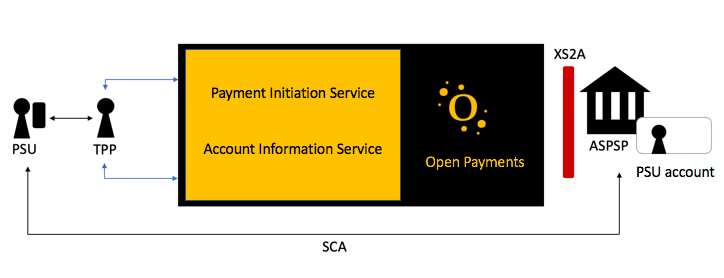

## About

Open Payments Platform marks a milestone in the emerging space of Open Banking as we now can offer our customer the full scope of PSD2, covering private accounts for all [supported banks](banks.md). 

Whether you are building a FinTech or accounting app, E-commerce business, ERP software, or managing a subscription service of any kind, Open Payments will connect you to banks in Europe through one unified API.
We have integrated our platform with the banks' APIs and regardless of version or standard, we present a unified API to you.

You integrate with our unified REST API providing you with access to the payment rails. How you decide to present the customer-journey to your client is your
choice and your brand.

The service is white labeled, meaning you own your customers journey! We provide a way to handle authorization of a payment or access to account information from
behind the scene.

Work with both individual and company accounts. The documentation cover general information on our platform as well as specific information you will need to successfully integrate your solution and your customer journey with our REST API. 

We welcome developers to dig in and start making revolutionary new solutions, tools and services using our unified API. 

### Standards
The first generation of Open Payments API is based on the [Berlin Groups NextGen specification](https://www.berlin-group.org/psd2-access-to-bank-accounts). 
This common API standard was developed to create uniform and interoperable communications between banks and TPPs.