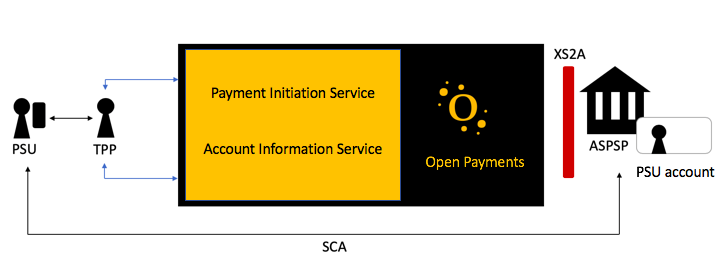

# The Open payments solution

The Open Payments platform integrates with financial institutes, referred to as Account Servicing Payment Service Providers (ASPSPs) via the XS2A Interface, which is designed as a B2B interface between a TPP server and the ASPSP server.

As a developer you are referred to as a Third Party Provider (TPP) and integrate with the Open Payments API services in the Open Payments platform.
The end user is known as a Payment Services User (PSU).

The Strong Customer Authentication (SCA) approach basically determines how the authorisation is made between the PSU and the ASPSP. 
For more information about the various approaches, see [SCA approaches](sca.md).

## Get Account information 
## Get Consent
## Create Payments
